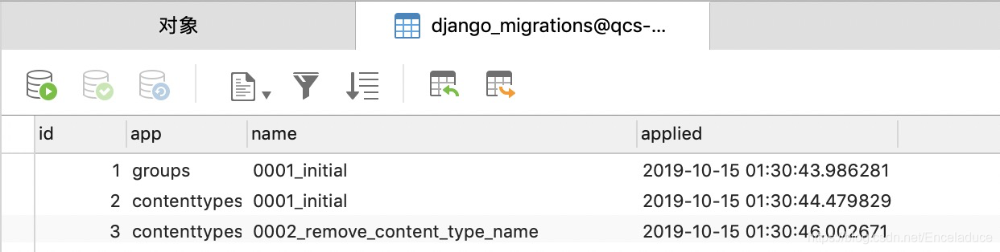
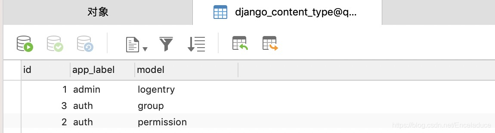
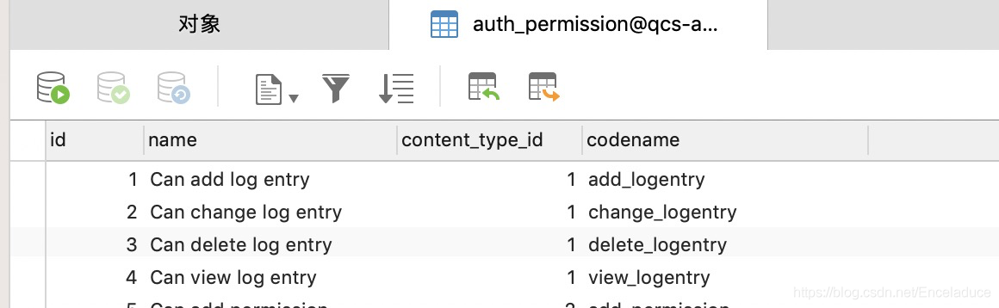

# Django-migrate-fake-与-fake-initial

Django的migrate 系列命令必须要结合数据库来理解。

migrate命令执行时Django会做4件事：\
1，迁移判定，将你的项目中所有未迁移的变动文件进行迁移（django会去查询django\_migrations表判断你是否有新的迁移变动）

<figure><figcaption></figcaption></figure>

<figure><figcaption></figcaption></figure>

在完成接下来的迁移后，便会在该表中生成一条迁移记录。

2，迁移映射关系 django\_contenttype表新增映射关系（app与模型关系）

<figure><figcaption></figcaption></figure>

3，迁移权限 auth\_permission表新增权限

<figure><figcaption></figcaption></figure>

4 ，执行迁移，生成数据表，或变动

migrate --fake 只执行第一步，并生成迁移记录。

migrate --fake-initial 执行前三步，不实际变动数据库

migrate 全部依次执行所有步骤。

python manage.py showmigrations

python manage.py migrate --fake app\_name zero

python manage.py migrate --fake app
